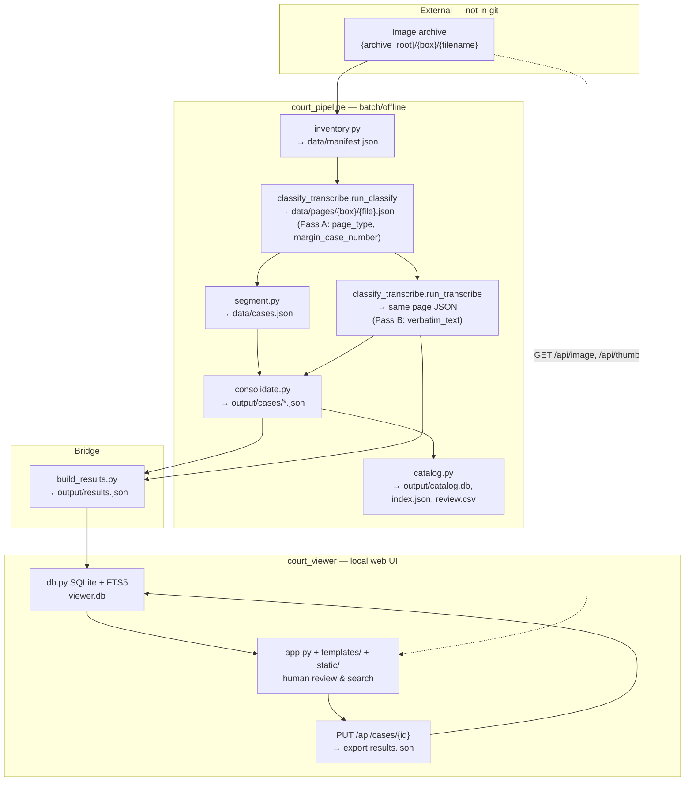

# Archival Extraction Project — Reusable Architecture Model

Reference implementation for a **two-package archival extraction system**: an offline vision-LLM pipeline (`court_pipeline`) and a local FastAPI review UI (`court_viewer`). Domain: South African Resident Magistrate's Court civil case photos (1880–1920). The pattern generalizes to any image corpus requiring page classification, verbatim transcription, document grouping, structured field extraction, and human correction.

---

## 1. High-level architecture

### Separation of concerns

| Package | Role | Runtime | Mutates pipeline data? |
|---------|------|---------|------------------------|
| `court_pipeline/` | Batch/offline extraction | CLI (`python -m court_pipeline.run …`) | Yes — writes `data/` and `output/` |
| `court_viewer/` | Single-user web viewer/editor | FastAPI + vanilla JS (`uvicorn court_viewer.app:app`) | No — reads pipeline outputs; writes only `results.json` + local cache |

`court_viewer/` treats `court_pipeline/` as **read-only upstream**. The bridge is `court_viewer/build_results.py`, which merges pipeline JSON into the viewer's portable `results.json`.

### Data flow



**Stage order** (from `run.py` `cmd_all`):

```
inventory → classify → segment → transcribe → cases (consolidate) → catalog
```

`segment` only needs Pass A (classification). `cases` needs both segment index and Pass B transcripts.

Convenience command `pages` = `classify` + `transcribe`.

### Canonical vs ephemeral

| Artifact | Location | Canonical? | Notes |
|----------|----------|------------|-------|
| Source images | `../Law Agent Civil Cases/{box}/` | **Yes** (external archive) | Never modified by pipeline/viewer |
| Image manifest | `data/manifest.json` | **Yes** (pipeline cache) | SHA1-keyed; incremental |
| Per-page records | `data/pages/{box}/{filename}.json` | **Yes** | Both passes write same file; idempotent on `sha1` |
| Case segmentation index | `data/cases.json` | **Yes** | Grouping metadata, not LLM output |
| Per-case extraction | `output/cases/*.json` | **Yes** (pipeline SoT for extraction) | One JSON per case |
| Pipeline catalog | `output/catalog.db`, `index.json`, `review.csv` | Ephemeral/query | Rebuilt from case JSONs |
| Consolidation markers | `output/cases/.done_{case_id}` | Ephemeral | Skip re-consolidation |
| Batch job state | `data/batch_pending.json` | Ephemeral | Resume in-flight Gemini batches |
| **Viewer canonical** | `output/results.json` | **Yes** (portable, syncs via OneDrive) | Tri-value schema; survives machine moves |
| Viewer SQLite | `~/.court-viewer/viewer.db` | Ephemeral | Outside OneDrive (WAL); rebuilt when `results.json` mtime > DB token |
| Thumbnails | `~/.court-viewer/thumbnails/` | Ephemeral | Outside OneDrive; on-demand Pillow cache |
| Results backups | `~/.court-viewer/backups/` | Ephemeral | Snapshot taken before each merge/export; last 20 kept |
| User edits | `results.json` → `fields.*.edited`, `pages.*.transcript.edited` | **Yes** | Preserved across `build_results` regeneration |

**Key design choice:** pipeline outputs are flat JSON on disk (gitignored, OneDrive-synced). SQLite appears twice — once as a pipeline query index (`catalog.db`), once as a viewer working store — and is always rebuildable.

**Why the viewer DB is not in the project tree:** it runs in WAL mode, so the live database is a `.db` plus its `-wal` and `-shm` companions. A sync client uploads those files independently and will happily restore a `.db` without the WAL that completes it, producing corruption or a silent rollback. Everything under `~/.court-viewer/` is therefore local and rebuildable from `results.json`; set `COURT_VIEWER_HOME` to relocate it. This mirrors sna-exemptions' `~/.sna-exemptions/` and the rationale in `Newspaper Transcriptions/docs/SCALE_PLAN.md` §5.3.

---

## 2. Directory layout pattern

```
Law Agent Cases/
├── court_pipeline/                 # Batch extraction package
│   ├── config.yaml                 # Production config (paths relative to this dir)
│   ├── config.test.yaml            # mock provider → data_test/, output_test/
│   ├── config.batch-test.yaml      # Isolated Gemini batch verification
│   ├── config.opus-test.yaml       # Provider/model experiments
│   ├── .env.example / .env         # API keys (gitignored)
│   ├── .gitignore                  # data/, output/, *_test/, .env, .venv
│   ├── requirements.txt
│   ├── README.md
│   ├── run.py                      # CLI entry: subcommands per stage
│   ├── config.py                   # Config class: path resolution, stage routing
│   ├── schema.py                   # Pydantic: PageRecord, CaseRecord, PAGE_TYPES, CASE_FIELDS
│   ├── prompts.py                  # CLASSIFY_PROMPT, TRANSCRIBE_PROMPT, CONSOLIDATION_PROMPT
│   ├── inventory.py                # manifest builder
│   ├── classify_transcribe.py      # Pass A + Pass B + batch/live executors
│   ├── segment.py                  # page → case grouping
│   ├── consolidate.py              # case-level LLM extraction + deterministic full_transcript
│   ├── catalog.py                  # SQLite catalog + CSV review queue
│   ├── pageio.py                   # EXIF + downscale → JPEG bytes for LLM
│   ├── util.py                     # JSON I/O, sha1, natural sort, lenient JSON parse
│   ├── estimate.py                 # Cost dry-run
│   ├── batch_pending.py            # Persist/resume Gemini batch jobs
│   ├── relocate_paths.py           # Fix stale absolute paths after project move
│   ├── retry_opus_pages.py         # Ad-hoc reprocessing utility
│   ├── providers/
│   │   ├── base.py                 # LLMRequest, LLMResult, Provider ABC
│   │   ├── __init__.py             # get_provider_named() with memoized cache
│   │   ├── gemini.py               # Live + file-based JSONL batch
│   │   ├── anthropic.py
│   │   ├── openai.py
│   │   └── mock.py                 # Zero-API offline testing
│   ├── data/                       # GITIGNORED working cache
│   │   ├── manifest.json
│   │   ├── cases.json
│   │   ├── pages/{box}/{file}.json
│   │   └── batch_pending.json
│   └── output/                     # GITIGNORED deliverables
│       ├── cases/*.json
│       ├── catalog.db
│       ├── index.json
│       ├── review.csv
│       └── results.json            # Written by court_viewer/build_results.py
│
├── court_viewer/                   # Review UI package (self-contained)
│   ├── config.yaml
│   ├── config.batch-test.yaml    # Points at pipeline *_batch_test dirs
│   ├── config.py                   # COURT_VIEWER_CONFIG env override
│   ├── viewer_schema.py            # results.json schema + tri-value helpers
│   ├── build_results.py            # Pipeline → results.json merger
│   ├── db.py                       # SQLite + FTS5
│   ├── app.py                      # FastAPI routes
│   ├── sample_data.py              # Offline sample results.json generator
│   ├── templates/index.html
│   ├── static/app.js, style.css
│   └── backup.py                   # results.json snapshots before each rewrite
│
├── ~/.court-viewer/                # LOCAL STATE (outside OneDrive, rebuildable)
│   ├── viewer.db                   # + -wal / -shm companions
│   ├── thumbnails/
│   └── backups/                    # results-<utc>-<build|export>.json
│
└── ../Law Agent Civil Cases/       # SOURCE ARCHIVE (sibling dir, not in repo)
    └── {box_name}/
        └── IMG_*.jpg, DSC_*.jpg …
```

### Config layering

1. **Base:** `config.yaml` — provider, `stages.*` model routing, paths, image prep, segment rules, pricing heuristics.
2. **Test overlays:** `config.test.yaml` (mock, isolated dirs), `config.batch-test.yaml`, `config.opus-test.yaml`.
3. **CLI override:** `--config path/to.yaml` on every `court_pipeline.run` command.
4. **Viewer override:** `COURT_VIEWER_CONFIG` env var or `--config` on `build_results`.
5. **Secrets:** `.env` via `python-dotenv` — never in YAML. Keys: `GOOGLE_API_KEY`, `ANTHROPIC_API_KEY`, `OPENAI_API_KEY`.
6. **Runtime env:** `COURT_PIPELINE_TRANSCRIBE_MAX_OUTPUT_TOKENS` overrides transcribe token budget.

**Path resolution:** all relative paths resolve from the config file's directory (`Config.base_dir` in both packages). After moving the project tree, run `python -m court_pipeline.run relocate-paths`.

### Source vs output locations

- **Source archive:** outside the Python packages (`images_root: "../Law Agent Civil Cases"`).
- **Intermediate cache:** `court_pipeline/data/` (per-page JSON keyed by content hash).
- **Pipeline deliverables:** `court_pipeline/output/cases/`.
- **Human-review artifact:** `court_pipeline/output/results.json` (built by viewer, edited in viewer, portable).

---

## 3. Pipeline stages (generic pattern)

### Stage 0: Inventory / catalog of source material

| | |
|---|---|
| **Module** | `inventory.py` → `build_manifest()` |
| **CLI** | `python -m court_pipeline.run inventory` |
| **Input** | `{images_root}/{box}/` image files |
| **Output** | `data/manifest.json` |
| **Schema** | `{generated_at, images_root, n_boxes, n_images, n_new, boxes: {box: [{filename, path, order, size, sha1, is_first_in_box, is_new}]}}` |
| **Idempotency** | Reuses SHA1 when file size unchanged; flags `is_new` for changed/new files |
| **Batch/sync** | Sync filesystem walk; no LLM |

**Generic pattern:** walk archive folders in natural sort order; content-hash every file; maintain incremental manifest for `--new-only` processing.

---

### Stage 1: Page classification (Pass A)

| | |
|---|---|
| **Module** | `classify_transcribe.py` → `run_classify()` |
| **Input** | Manifest entries; JPEG bytes via `pageio.prepare_image_bytes()` |
| **Output** | Same `data/pages/{box}/{filename}.json` — adds classification fields |
| **Schema** | `PageRecord`: `page_type`, `margin_case_number`, `detected_rotation_degrees`, `languages`, `classified_at`, `classify_model`, `classify_error` |
| **Idempotency** | Skip if `classified_at` set and `sha1` matches; `--force` re-runs; first image in box auto-marked `box_photo` (no API) |
| **Batch/sync** | Default **live**; optional **batch** (Gemini only); per-stage `stages.classify.mode` |

**Prompt:** `prompts.CLASSIFY_PROMPT` — marker string `TASK: CLASSIFY` for mock routing.

**Generic pattern:** cheap/fast model triages every page before expensive extraction. Output stays small (no transcription).

---

### Stage 2: Document segmentation

| | |
|---|---|
| **Module** | `segment.py` → `segment_cases()` |
| **Input** | Classified `PageRecord`s from `data/pages/` |
| **Output** | `data/cases.json` |
| **Schema** | `{cases: [{case_id, box, is_appeal, page_files, page_cache_files, page_types, page_range, cover_filename, provisional_case_number, needs_review, …}]}` |
| **Idempotency** | Deterministic re-run; overwrites index |
| **Batch/sync** | Sync; no LLM |

**Split rules** (configurable in `segment:`):

- New case on `cover_regular` / `cover_appeal` page types
- New case on `margin_case_number` change (if `split_on_margin_case_number_change: true`)
- New case on box boundary
- `box_photo` pages reset box context but attach to nothing

**Generic pattern:** rule-based grouping using classification metadata — no LLM required. Domain-specific rules live in `segment.py` + config.

---

### Stage 3: Transcription / extraction (Pass B)

| | |
|---|---|
| **Module** | `classify_transcribe.py` → `run_transcribe()` |
| **Input** | Classified pages; routed by `page_type` |
| **Output** | Same page JSON — adds `verbatim_text`, `transcribed_at`, `transcribe_model`, `transcription_status` |
| **Schema** | `transcription_status`: `pending` \| `done` \| `skipped` |
| **Idempotency** | Skip if transcribed and `sha1` matches; skip-types get `verbatim_text=""` with no API call |
| **Batch/sync** | Default **batch** for transcribe; model routing via `stages.transcribe.type_models` |

**Model routing** (from `config.yaml` `stages.transcribe`):

- `skip_types: [blank, box_photo]` → no API
- `type_models: {warrant: flash, bill_of_costs: flash}` → cheaper model
- Everything else → `default_model` (pro tier)

**Generic pattern:** multi-tier extraction — route by document type; skip irrelevant pages entirely.

---

### Stage 4: Consolidation / case-level extraction

| | |
|---|---|
| **Module** | `consolidate.py` → `run_consolidate()` |
| **Input** | `data/cases.json` + page transcripts + cover image |
| **Output** | `output/cases/{box}__case_{number}__{suffix}.json` |
| **Schema** | `CaseRecord` — structured fields + `field_confidence`, `uncertain_fields` |
| **Idempotency** | `.done_{case_id}` marker files; `--force` bypasses |
| **Batch/sync** | Always **live** (concurrent ThreadPoolExecutor) |

**Critical pattern — deterministic assembly:**

- `assemble_full_transcript()` concatenates per-page `verbatim_text` in order (code, not LLM).
- LLM extracts only short header/outcome fields via `CONSOLIDATION_PROMPT`.
- `field_confidence["full_transcript"] = "derived"`.

**Generic pattern:** never ask the LLM to regenerate long text it already produced at page level — assemble long fields in code to prevent drift.

---

### Stage 5: Catalog / review queue

| | |
|---|---|
| **Module** | `catalog.py` → `build_catalog()` |
| **Input** | All `output/cases/*.json` |
| **Output** | `output/catalog.db`, `index.json`, `review.csv` |
| **Idempotency** | Full rebuild (deletes old DB) |
| **Batch/sync** | Sync |

**review.csv** flags cases with missing fields, `field_confidence: low`, or `uncertain_fields`.

---

### Batch job management

- **Live mode:** `ThreadPoolExecutor` with configurable `run.concurrency`; graceful stop on daily quota (`DailyQuotaExceeded`).
- **Batch mode:** Gemini-only; groups requests by provider then model; file-based JSONL upload via `providers/gemini.py`.
- **Resume:** `batch_pending.py` + `GeminiProvider.resume_pending_batches()` — re-submit skips in-flight keys.
- **Failure policy:** batch failures are **fatal** (no automatic live fallback).
- **Cost estimate:** `estimate.py` before paid runs.

---

## 4. Data schemas

### Page-level (`schema.PageRecord`)

**Machine-extracted:**

- Classification: `page_type`, `margin_case_number`, `detected_rotation_degrees`, `languages`
- Transcription: `verbatim_text`
- Provenance: `sha1`, `provider`, `classify_model`, `transcribe_model`, `classified_at`, `transcribed_at`, `transcription_status`
- Errors: `classify_error`, `transcribe_error`

**Pipeline-filled metadata:** `box`, `filename`, `path`, `order`

**Page types** (`PAGE_TYPES`): `box_photo`, `blank`, `cover_regular`, `cover_appeal`, `warrant`, `bill_of_costs`, `plea`, `hearing`, `other`

### Document/case-level (`schema.CaseRecord`)

**Machine-extracted:** all `CASE_FIELDS` — `case_number`, `district`, `magistrate`, parties, `claim`, dates, appearances, `interpreter`, `plea_verbatim`, `verdict`, `full_transcript` (derived)

**Quality metadata:** `field_confidence`, `uncertain_fields`, `language_notes`, `is_appeal`

**Structural:** `case_id`, `box`, `source_images`, `page_range`, `provider`, `model`, `processed_at`, `error`

### Bundle-level (viewer `results.json`)

Top-level document (`viewer_schema.SCHEMA_VERSION = 1`):

```json
{
  "schema_version": 1,
  "generated_at": "<iso8601>",
  "archive_root": "<abs path>",
  "cases": [ /* normalized case objects */ ]
}
```

### Tri-value fields (human-editable layer)

Every extracted field and page transcript uses `{gemini, claude, edited}`:

- **Effective value** = `edited` if non-null, else `gemini`
- **`claude`** = reserved alternate provider slot (preserved, not indexed for search)
- **`gemini`** = pipeline baseline (never overwritten by viewer saves)
- **`notes`** = user-only (`gemini` always null)
- **`review_status`** = `unreviewed` \| `in progress` \| `verified` \| `flagged`

### Versioning / provenance

| Layer | Fields |
|-------|--------|
| Page | `sha1`, per-pass timestamps/models, `transcription_status` |
| Case (pipeline) | `provider`, `model`, `processed_at`, `field_confidence` |
| Case (viewer) | `provenance: {provider, model, processed_at}` |
| Schema | `schema_version` in `results.json`; legacy page records auto-migrated in `_migrate_legacy()` |

---

## 5. Provider abstraction

### Interface (`providers/base.py`)

```python
@dataclass
class LLMRequest:
    prompt: str
    images: List[bytes]
    max_output_tokens: int
    key: Optional[str]       # match batch results back to source
    model: Optional[str]     # per-request override
    pass_name: Optional[str]

class Provider:
    supports_batch: bool = False
    def generate(self, req: LLMRequest) -> LLMResult: ...
    def generate_batch(self, requests, model=None) -> List[LLMResult]: ...
```

### Factory (`providers/__init__.py`)

- `get_provider_named(cfg, name)` — memoized instances on `cfg._provider_cache`
- Supports mixing providers per stage: e.g. Gemini classify + Anthropic consolidate

### Implementations

| Provider | Module | Batch | Notes |
|----------|--------|-------|-------|
| `gemini` | `gemini.py` | Yes | Default; JSON response mode; file-based JSONL batch |
| `anthropic` | `anthropic.py` | No | Vision via Claude API |
| `openai` | `openai.py` | No | GPT-4o vision |
| `mock` | `mock.py` | No | Prompt-marker routing; deterministic page types from SHA1 of key |

### Prompts location

All in `court_pipeline/prompts.py`:

- `CLASSIFY_PROMPT` — marker `TASK: CLASSIFY`
- `TRANSCRIBE_PROMPT` — marker `TASK: TRANSCRIBE`
- `CONSOLIDATION_PROMPT` — marker `BEGIN PAGE TRANSCRIPTIONS`
- `PAGE_PROMPT` — legacy single-pass (retained)

Mock provider inspects these markers to return appropriate canned JSON.

### Per-stage provider/model config

```yaml
stages:
  classify:
    provider: gemini
    model: gemini-2.5-flash
  transcribe:
    default_provider: gemini
    default_model: gemini-3.1-pro-preview
    type_models: { warrant: gemini-2.5-flash }
    type_providers: {}
    skip_types: [blank, box_photo]
  cases:
    provider: gemini
    model: gemini-2.5-flash
```

---

## 6. Viewer architecture

### FastAPI app (`court_viewer/app.py`)

- `create_app(config)` factory; module-level `app` for uvicorn
- Startup + per-request: `db.ensure_fresh(cfg)` — rebuild SQLite if `results.json` mtime > stored token
- Static mount: `/static` → `static/`
- Single-page frontend: `GET /` serves `templates/index.html`

### SQLite as read/write cache; JSON as source of truth

```
results.json ──(rebuild if stale)──► SQLite (viewer.db)
         ▲                                    │
         └──── export on every PUT ──────────┘
```

Staleness token stored in `meta.results_mtime`. After save-export, token is re-synced so the app's own write is not treated as external change.

### Import/export workflow

1. **Initial build:** `python -m court_viewer.build_results` — reads `output/cases/*.json` + `data/pages/`, writes `results.json`, preserves existing edits by `case_id`.
2. **Start server:** `uvicorn court_viewer.app:app` — auto-rebuilds DB if needed.
3. **Edit:** `PUT /api/cases/{case_id}` — sets `edited` slots only.
4. **Auto-export on save:** every PUT calls `db.export_results(cfg)`.
5. **Manual sync:** `POST /api/export`, `POST /api/rebuild`.

### UI patterns

| Pattern | Implementation |
|---------|----------------|
| **List view** | Left sidebar `#case-list`; filters by `review_status`, `box`; search replaces list |
| **Detail view** | Right panel: tri-value form fields, page list, full_transcript panel |
| **Image display** | Page review panel (`#lightbox`): full image via `/api/image?box=&filename=` |
| **Page transcript edit** | Lightbox textarea syncs to page list; case-level Save persists |
| **Dirty guard** | `#dirty-indicator`; modal on navigation; `beforeunload` on tab close |
| **Search** | FTS5 via `/api/search`; scope checkboxes per field + transcript + notes |

### Keyboard shortcuts (`static/app.js`)

| Key | Action |
|-----|--------|
| `↑` / `↓` | Previous/next case in list (when not in form focus) |
| `←` / `→` | Previous/next page in lightbox (when not editing transcript) |
| `+` / `-` / `0` | Zoom in/out/fit in lightbox |
| `Esc` | Close lightbox or transcript panel |
| Ctrl/meta + scroll | Zoom in lightbox |

Explicit **Save** button required (no Ctrl+S shortcut).

### Thumbnail generation

- `GET /api/thumb?box=&filename=`
- Pillow: EXIF transpose → RGB → thumbnail (`thumbnail.max_dimension`, default 400px)
- Cache: `{thumbnails_dir}/{box}/{filename}.jpg`
- Regenerated if source mtime newer than cache
- Path traversal protection: `relative_to(archive_root)` / `relative_to(thumbnails_root)`

---

## 7. Configuration patterns

### `config.yaml` structure (pipeline)

```yaml
provider: gemini
models: { gemini: ..., anthropic: ..., openai: ..., mock: ... }
stages: { classify: ..., transcribe: ..., cases: ... }
paths:
  images_root: "../Law Agent Civil Cases"
  data_dir: "data"
  output_dir: "output"
image: { max_dimension, jpeg_quality, apply_exif_transpose }
run: { mode, concurrency, max_retries, skip_first_image_in_box }
segment: { cover_types, split_on_margin_case_number_change }
pricing: { models: {...}, gemini: {...} }
estimate: { token heuristics, batch_price_multiplier }
```

### Path resolution after project moves

1. Config paths are relative to config file directory — update `images_root` if archive moved.
2. Run `python -m court_pipeline.run relocate-paths` — rewrites cached absolute paths in manifest, page JSON, cases index, results.json; rebuilds manifest.
3. Runtime image lookup prefers `{images_root}/{box}/{filename}` over stale stored `path` (`inventory.resolve_image_path()`).

### `.gitignore` for large/generated data

From `court_pipeline/.gitignore`:

```
.env
data/
output/
data_test/
output_test/
data_batch_test/
output_batch_test/
.venv/
```

Viewer DB, thumbnails and results backups live under `~/.court-viewer/`, outside the repo and outside OneDrive. Source images live outside the repo entirely.

---

## 8. Testing patterns

### Automated suite (pytest)

```bash
cd "Law Agent Cases"
pip install -r requirements-dev.txt
pytest
```

Fast (~2s), fully offline, no API calls: the pipeline runs through the `mock`
provider. Every test works in a `tmp_path` tree with `COURT_VIEWER_HOME` pointed
at a temp directory, so the suite cannot read or write the real archive,
`results.json`, or `~/.court-viewer`.

| File | Covers | Why it exists |
|------|--------|---------------|
| `tests/test_segment.py` | Case boundaries: covers, margin-number changes and normalization, box boundaries, orphan pages before the first cover, `box_photo`/`blank` handling, cache-key derivation | A bad split silently merges two cases; every downstream field inherits it |
| `tests/test_merge.py` | Tri-value merge: `edited`/`claude`/notes/`review_status` preserved, `gemini` and structural metadata refreshed, orphan cases retained, idempotent across repeats | `results.json` is the only copy of every human correction |
| `tests/test_relocate_paths.py` | Path repair after a tree move, including the same-root case | Regression suite for a shipped bug (see below) |
| `tests/test_consolidate_guard.py` | Which page states count as a gap; held-back cases not marked done; `--allow-incomplete` records gaps; assembly order and skip types | A failed page would otherwise vanish from `full_transcript` silently |
| `tests/test_backup.py` | Snapshot content, rotation, disable, non-fatal failure, wiring into both write paths | The snapshot is the only undo for human edits |
| `tests/test_config_paths.py` | Canonical vs ephemeral resolution, absolute overrides, and assertions against the **shipped** config files | Guards the file that decides where the real DB lands |
| `tests/test_viewer_api.py` | Edit round trip through FastAPI → SQLite → `results.json`, FTS search, staleness pickup of an externally synced file, path-traversal rejection | The seam where the three stores meet |

**Worked example of why:** `relocate-paths` wrapped its whole body in
`if old_root != new_root` and never repaired `page_cache_files`. When the tree
moved but `images_root` did not, it reported success while all 6,771 cache paths
stayed broken — and since `_page_verbatim_text` returns `""` for a missing file,
consolidation would have emitted empty transcripts and marked the cases done.
`tests/test_relocate_paths.py` fails 7 of 10 against that code and passes against
the fix.

### Manual / integration mechanisms (still useful)

| Mechanism | Config / command | Purpose |
|-----------|------------------|---------|
| **Mock provider** | `--config court_pipeline/config.test.yaml` | Full pipeline offline; writes to `data_test/`, `output_test/` |
| **Sample viewer data** | `python -m court_viewer.sample_data` | 4 synthetic cases referencing real images in box `1-NKE 2-1-1-11` |
| **Batch verification** | `config.batch-test.yaml` + viewer overlay | Isolated Gemini batch path test |
| **Cost dry-run** | `python -m court_pipeline.run estimate` | No API calls |
| **Smoke limits** | `--limit N`, `--box NAME` | Partial runs |

### Not yet covered

Provider adapters and the Gemini batch submit/poll path (`providers/`,
`batch_pending.py`), `catalog.py`, `estimate.py`, and the classify/transcribe
retry and escalation logic. sna-exemptions has batch coverage in
`tests/test_batch.py` if that becomes worth mirroring.

---

## 9. Adaptation guide for new projects

### Checklist: new source material

- [ ] Place images under `{archive_root}/{container}/{filename}` — define container naming (box, bundle folder, etc.)
- [ ] Update `paths.images_root` in both pipeline and viewer configs
- [ ] Adjust `inventory._list_boxes()` if archive hierarchy differs (e.g. nested containers)
- [ ] Update `util.IMAGE_EXTS` if non-standard formats

### Checklist: new extraction fields

- [ ] Add fields to `schema.CaseRecord` + `CASE_FIELDS` list
- [ ] Update `CONSOLIDATION_PROMPT` with new keys + confidence mapping
- [ ] Add to `viewer_schema.FIELD_NAMES` (display order)
- [ ] Update `catalog.SCALAR_COLUMNS` if queryable in pipeline catalog
- [ ] Update `build_results._case_from_pipeline()` (auto via `FIELD_NAMES` loop)
- [ ] Update frontend field sets in `static/app.js` (`LONG_FIELDS`, `YES_NO_FIELDS`, etc.)

### Checklist: new page types / archive layout

- [ ] Extend `PAGE_TYPES` in `schema.py`
- [ ] Update `CLASSIFY_PROMPT` and `TRANSCRIBE_PROMPT` guidance
- [ ] Configure `stages.transcribe.type_models` / `skip_types`
- [ ] Adjust `segment.py` rules (`cover_types`, split conditions)
- [ ] Update `mock.py` `_MOCK_PAGE_TYPE_CYCLE` for offline coverage

### Domain-specific vs reusable pattern

| Reusable pattern | Domain-specific |
|------------------|-----------------|
| `run.py` subcommand CLI | `PAGE_TYPES`, split rules in `segment.py` |
| `inventory.py` manifest + SHA1 idempotency | Box/folder naming convention |
| Two-pass classify/transcribe | Prompt text in `prompts.py` |
| `providers/` abstraction | Field names in schema |
| `consolidate.py` deterministic long-text assembly | Segmentation heuristics |
| `build_results.py` edit-preserving merge | `CASE_FIELDS` list |
| `db.py` FTS5 + tri-value schema | Review status labels |
| `app.py` REST + image serving | Frontend field layout |
| `config.py` path resolution | Archive path in config.yaml |
| `relocate_paths.py` | — |
| `batch_pending.py` | — |

### Naming conventions

- **Page cache:** `data/pages/{box}/{filename}.json`
- **Case output:** `{box}__case_{number}{_appeal}__{case_id_suffix}.json`
- **Case ID:** `{box}__{seq:03d}` from segmentation
- **Done marker:** `.done_{safe_slug(case_id)}`
- **CLI module invocation:** `python -m court_pipeline.run <command>` from parent of package dir

### Scaling considerations

| Concern | Approach |
|---------|----------|
| **20k+ images** | Incremental manifest; `--new-only`; per-page JSON cache keyed on SHA1 |
| **Cost** | Two-pass routing; skip types; `estimate` before runs; batch mode (~50% Gemini discount) |
| **Latency vs cost** | Per-stage `mode: live \| batch`; classify live, transcribe batch |
| **Quota exhaustion** | Daily quota detection stops gracefully; cached work preserved; re-run same command |
| **Batch timeouts** | `batch_pending.json` + resume on next run |
| **Parallelism** | `run.concurrency` for live; batch grouped by model |
| **Human review** | Single `results.json` syncs via cloud storage; SQLite disposable per machine |
| **Re-pipeline safety** | `build_results` preserves `edited`, `claude`, `review_status`, `notes` |

---

## 10. Comparison with sna-exemptions

Both projects implement the same **core architectural pattern**:

```
[image archive] → [batch pipeline with page cache] → [grouped document JSON]
                              ↓
         [results.json canonical] ↔ [SQLite viewer cache] → [human edits → export]
```

### Shared patterns

| Pattern | Law Agent Cases | sna-exemptions |
|---------|-----------------|----------------|
| JSON canonical, SQLite ephemeral | `results.json` + `viewer.db` | Per-bundle `results.json` + `~/.sna-exemptions/petitions.db` |
| Tri-value / edit preservation | `{gemini, claude, edited}` | `field_edits` + manual edit protection on re-import |
| Page classification before extraction | Pass A in `classify_transcribe.py` | `classify_folder()` in `pilot.py` |
| Document grouping | `segment.py` (cases from pages) | `sna_exemptions/group.py` (petition bundles) |
| Multi-provider | `providers/` package | `sna_exemptions/models/gemini.py`, `claude.py` |
| Batch API | `providers/gemini.py` + `batch_pending.py` | `sna_exemptions/batch.py` |
| FastAPI viewer | `court_viewer/app.py` | `viewer/app.py` |
| Thumbnails on demand | Pillow cache in viewer | Same pattern |
| Archive discovery | `inventory` (manifest) | `sna_exemptions/discover.py` + `pilot.py --scan` |

### Key differences

| Aspect | Law Agent Cases | sna-exemptions |
|--------|-----------------|----------------|
| **Document unit** | Court **case** (multi-page civil record) | Exemption **petition bundle** |
| **Grouping signals** | Cover pages + margin case number + box | Page types + admin/list page detection |
| **Extraction stages** | Explicit 6-stage CLI (`run.py`) | Monolithic `pilot.py` orchestrator |
| **Page cache location** | `data/pages/{box}/` | `data/pilot/{folder}/` per bundle |
| **Canonical output layout** | Single merged `results.json` | One `results.json` per bundle folder |
| **Dual-provider compare** | Schema-ready (`claude` slot); not populated | Gemini + Claude runs built in |
| **Viewer DB location** | Outside OneDrive (`~/.court-viewer/`) | Outside OneDrive (`~/.sna-exemptions/`) |
| **Automated tests** | Mock provider integration only | pytest suite in `tests/` |
| **Pipeline entry** | `python -m court_pipeline.run all` | `python pilot.py` / batch shell scripts |
| **Long text assembly** | Deterministic `assemble_full_transcript()` | `admin_full_text` computed in `results.py` |

### When to copy which project

- **Copy Law Agent Cases** for: clean stage separation, two-pass cost routing, single portable `results.json`, explicit schema modules (`schema.py` / `viewer_schema.py`), relocate-paths tooling.
- **Copy sna-exemptions** for: per-bundle output folders, archive discovery/scan UX, richer batch orchestration (`batch.py`), dual-provider comparison workflow, pytest examples.

---

## Quick-start commands

```bash
# Pipeline (from parent of court_pipeline/)
python -m court_pipeline.run inventory
python -m court_pipeline.run estimate
python -m court_pipeline.run all --box "1-NKE 2-1-1-11" --limit 10

# Offline test
python -m court_pipeline.run --config court_pipeline/config.test.yaml all --box "1-NKE 2-1-1-22"

# Viewer
python -m court_viewer.build_results
python -m uvicorn court_viewer.app:app --host 127.0.0.1 --port 8000

# Offline viewer sample
python -m court_viewer.sample_data --output court_pipeline/output/results.json
```

This document is sufficient for an agent to scaffold a parallel project: replicate the two-package layout, implement the six pipeline stages with provider abstraction and SHA1-idempotent page cache, build the tri-value `results.json` bridge, and attach a FastAPI+SQLite+FTS5 review UI with edit-preserving regeneration.
